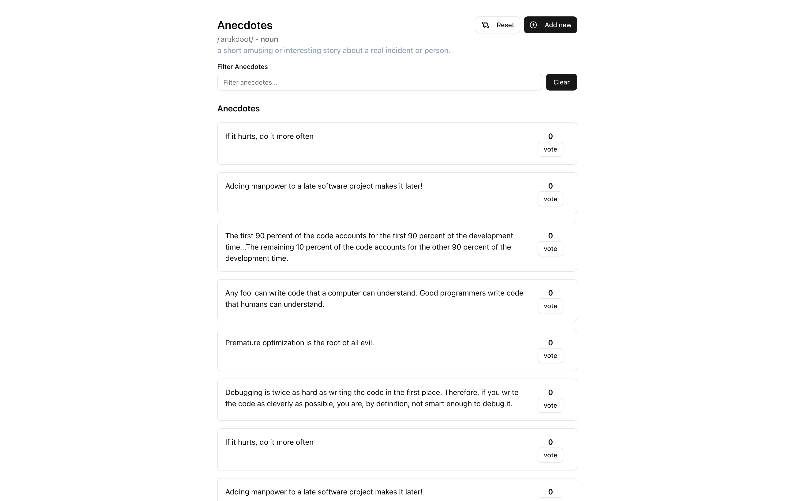

# Anecdotes
This is a project that covers the section 6 exercises. 

## About the project
We build a very basic web application that comprises of 2 parts: Frontend and Backend. Throughout the different exercises we have build out a anecdotes app, that displays anecdotes stored in a Redux store. By the end of the section, we have also built a new backend that the client side fetches the data from, and to which the users can also write to. For security and other reasons, we have enabled a feature that erases the anecdotes stored every 15 minutes. Meaning that if a user writes something, we stamp it on the server side, and it gets invalidated after this set period of time.

## Frontend
The frontend is build with the Basic Vite + React + Tailwind + Redux stack. However, I have opted to use Radix based components `Shadcn/ui` to beautify that application. Framer-motion is used to allow clean animations, and presense. Frontend is run on port `5173`

## Backend
The backend is built with Express.js & Typescript. We have a simple `dist/` directory that is used in the published version, but users can still use the `npm run dev` command to get the local version up and running. The backend is run on port `3001`

### Set up
You can simply clone the reposotiry, and `npm install` both the `part-6/anecdotes` and `part-6/anecdotes-backend` to get the backend and frontend to talk to each other. The frontend is setup in a way, that if the backend cannot be reached, we opt to only use the data on [https://raw.githubusercontent.com/fullstack-hy2020/misc/refs/heads/master/anecdotes.json](https://raw.githubusercontent.com/fullstack-hy2020/misc/refs/heads/master/anecdotes.json). This is a initial data file gotten from the creators of the fullstackopen -course.
